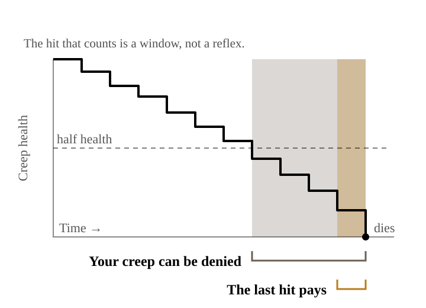

{/* _class: impact */}

# Should I hit this creep?

Week 2

---

## The most-asked question in the game

You will be asked this once every few seconds, for forty minutes, in every
game you ever play.

Nothing else in Dota comes up that often.

So it is worth getting an answer that is not "sure, why not".

---

{/* _class: impact */}

# Damage is not gold

---

## Only the last blow pays

You can put nine tenths of the damage into a creep and earn nothing.
Someone else presses attack once and takes all of it.

Dealing damage and earning gold are two different activities that happen to
use the same button.

Week 1 said the bots beat you because they were making decisions.
This is the first one.

---

## So what were you doing the rest of the time?

Holding down the attack key.

It feels like effort. It is the single most expensive habit a new player has.

---

## Three errors, one action

Holding attack:

1. **misses last hits** — your creep does the killing for you
2. **pushes the lane** — the wave moves toward their tower, away from safety
3. **pulls creep aggro** — swinging near their hero turns their creeps onto you

One key. Three problems. We will spend the rest of the course undoing each.

---

{/* _class: impact */}

# The other half of the question

---

## Denying

Below half health, you can kill your own creep.

The enemy gets **no gold** for it, and only part of the experience.

Nothing in any neighbouring game lets you do this.

---

## Two windows on one creep

---

{/* _class: quote */}

> Dota is the only game where refusing to let something happen is a thing you
> do with your hands.

Last-hitting is how you get paid.
Denying is how you decide what they get paid.

---

## Aggro is a tool

Attacking their hero turns their creeps onto you.

That is not a punishment for being aggressive. It is a lever:
it drags the wave back toward your side, where you are safe and they are not.

Beginners trigger it by accident.
The question this week trains is whether you meant to.

---

## The tower has rules

"Can I take this last hit under my tower?"

The tower's targeting is not a mood. It has an order, and the order does not
change. So this is a question with an answer, and by week 4 you will know it.

Very little in Dota is a coin flip. Most of what looks like one is something
you have not read yet.

---

{/* _class: impact */}

# Gold is time

---

## What ten creeps actually cost

Gold only becomes items. Items only pay off over the minutes that follow.

So ten missed creeps is not a handful of coins.
It is your key item arriving several minutes late —

and in those minutes, they are using theirs on you.

That is the whole economics of this course in one sentence, and we will keep
returning to it.

---

## This week's hero

**Dragon Knight** — *Dragon Blood*

Armour and regeneration, for free, forever.

It turns "don't die" into income. You get to make a few mistakes and still be
standing in the lane, which is where the gold is.

---

## This week's items

**Tango. Iron Branch.**

Neither one makes you stronger.

Both make you able to stay.

From your very first purchase, the question is *how do I get five more minutes
here* — not *how do I hit ten points harder*.

---

## Where we disagree with Valve

The official tutorial puts last-hitting in section three.

This course puts it in week two, on purpose:

until you know what one creep is worth, no other decision in the game has a
floor under it.

---

{/* _class: centered */}

## After this week

Take your share of the creeps in a bot game. Reliably.

Deny once, and say what you took away from them.

Say why you pressed attack on that creep — and not on the next one.

---

{/* _class: impact */}

# Lobby Lab 2

Bring the number you got today.
Assignment 1 marks what you do with it.
