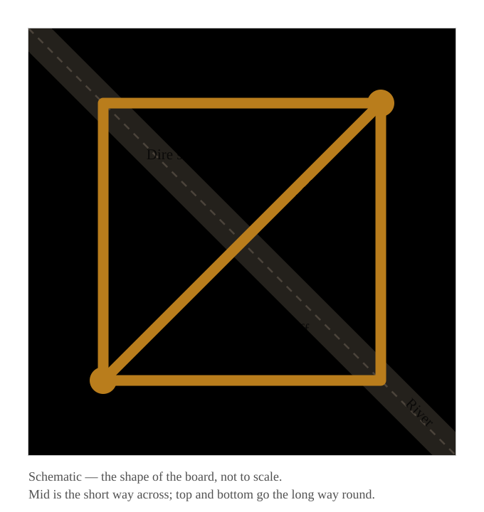

{/* _class: impact */}

# Where did he go?

Week 9

---

## Not a complaint. A report.

The most common sentence in a beginner's game.

It sounds like a complaint about the enemy.

It is a report about a resource you chose not to buy.

---

## The habit this week breaks

Warding at your own feet.

Or never looking at the minimap — and still pushing long after all five
enemies vanished from it.

---

{/* _class: impact */}

# The default is not knowing

---

## Fog

What you cannot see is still happening.

Everything this week is an attempt to buy your way out of that default, for a
while.

---

## Everywhere he could be

---

## Two items, opposite purchases

**Observer Ward** — buys vision.

**Sentry Ward** — buys the denial of **their** vision.

Beginners treat these as one item with two names. They are opposites.

---

## Fog is not the only way to hide

Some heroes are invisible, not just unseen.

The two problems have different answers.

---

## The cheapest things on this page

**Minimap habits.** Looking on a rhythm is a trainable action, not a talent.

**Pings.** Turning what you can see into what your team knows — for free.

---

{/* _class: impact */}

# Cheapest and most expensive

---

## Information

A ward costs almost nothing.

The death it would have prevented costs gold and a minute of the game.

And missing information sends no signal that it is missing —
you find out at the moment you die.

---

## Why wards wait until week 9

A ward is only worth what you know about which parts of the map matter.

That needs waves (week 3), the jungle (week 4) and positions (week 6).

Warding well is downstream of nearly everything else.

---

## This week's hero

**Vengeful Spirit** — *Wave of Terror*

It grants vision as a side effect.

An ability doing two jobs, while a beginner sees only one.

---

## This week's items

**Observer Ward. Sentry Ward.** Properly this time.

Week 4 used a ward to block a camp and promised the rest for later.

This is later.

---

{/* _class: centered */}

## After this week

Place a ward in a bot game with a stated purpose.

Say where an enemy probably is when they disappear — instead of pushing on.

Say what an Observer and a Sentry each bought you.

---

{/* _class: impact */}

# Lobby Lab 9

Cross the map unseen.
