{/* _class: impact */}

# Towers or heroes?

Week 10

---

## Winning, and nothing is happening

There is a point in most games where you are clearly ahead —

and nothing changes.

This week explains it.

---

{/* _class: quote */}

> A team that cannot convert a lead
> will win every fight and still lose the game.

---

## The habit this week breaks

Going home to shop after winning a teamfight.

The most expensive minute in the game —

spent in a menu.

---

{/* _class: impact */}

# What a lead turns into

---

## A tower is not only an obstacle

It gives vision. It gives a safe area. It gives gold.

And destroying one **permanently** changes the shape of the map you are both
playing on.

---

## Barracks

Take them, and the enemy's creep waves are weaker for the rest of the game.

One of the very few irreversible gains Dota offers.

---

## Roshan and the Aegis

One extra life, held in reserve.

In 7.41f Roshan prefers the **top pit** — so the fight is not where an older
guide says it is.

---

## The rest of the map

---

## Scheduled resources

Outposts and runes are small.

Their value is that they are **scheduled** — so you can plan time around them.

7.41f moved Tormentor to the bottom chasm.

---

## Teleport defence

One player carrying a scroll is one more defender for the whole team.

A cheap item, doing a structural job.

---

{/* _class: impact */}

# Converting a lead into map

---

## Nine weeks of saving. One week of spending.

Weeks 1 to 9 were about accumulating.

This week is about spending it.

An advantage you do not turn into buildings expires — the enemy heroes are
growing the whole time you admire yours.

---

## This week's hero

**Enigma** — *Black Hole*

It destroys nothing by itself.

It creates a window whose only purpose is to let the team do something else.

This week's subject, stated as an ability.

---

## This week's item

**Blink Dagger.**

Space has been the most abstract resource since week 1.

The dagger is where it becomes something you can pay for directly.

---

{/* _class: centered */}

## After this week

Say what to take after winning a fight.

Say whether your team should start Roshan — and name the timing or vision
that makes it worth it.

Explain why barracks and towers are different orders of magnitude.

---

{/* _class: impact */}

# Lobby Lab 10

Call the objective.
